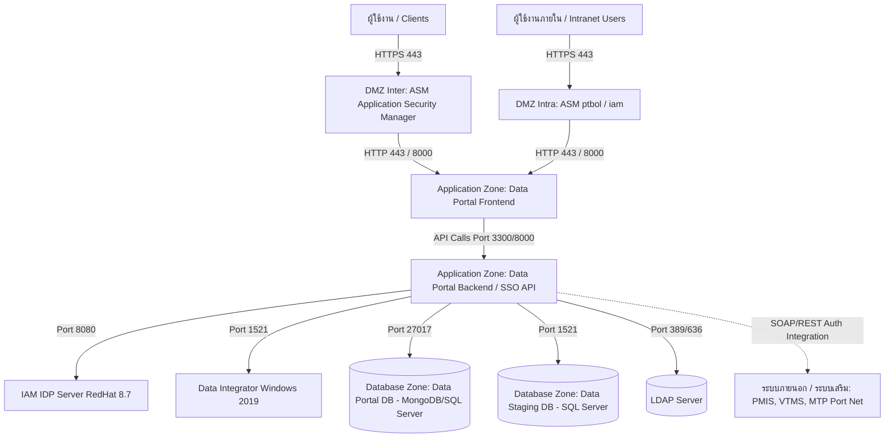

# เอกสารรายละเอียดสภาพแวดล้อมระบบ (Environment Details) และข้อกำหนดการเชื่อมต่อสำหรับระบบทดสอบ (UAT)
**โครงการ:** ระบบ Single Sign-On (SSO) Portal - Digital Smart Port (สทร.)  
**กำหนดเสร็จ:** 25 พฤษภาคม

---

## 1. ภาพรวมระบบ (System Overview)
ระบบ **SSO Portal** ทำหน้าที่เป็นศูนยกลางการยืนยันตัวตน (Identity Provider - IdP / Service Provider - SP Foundation) เพื่ออำนวยความสะดวกในการเข้าใช้งานระบบงานต่าง ๆ ของ สำนักงานท่าเรืออุตสาหกรรมมาบตาพุด (สทร.) จากจุดเดียว โดยรองรับการเชื่อมโยงระบบงานหลัก (Deep Link & Auth Bypass) ได้แก่:
1. **PMIS** (Personal Management Information System) - ระบบสารสนเทศการจัดการท่าเรือและระบบจัดเก็บรายได้
2. **VTMS** (Vessel Traffic Management System) - ระบบจัดการจราจรเรือและการเดินเรือ
3. **MTP Port Net** - เครือข่ายพอร์ทัลการขนส่งทางทะเล
4. **e-PP / Drone** - ระบบอนุญาตการบินโดรนและงานควบคุมการเข้าออกพื้นที่

---

## 2. การแบ่งโซนเครือข่ายและพอร์ตสำคัญ (Zoning Network & Ports Layout)
โครงสร้างพื้นฐานของระบบแบ่งออกเป็น 4 โซนหลักตามมาตรฐานความปลอดภัยข้อมูล เพื่อแยกส่วนการใช้งานภายนอก (Internet) และภายใน (Intranet):



### รายละเอียดพอร์ตและโซนการเข้าถึง (Ports and Access Matrix)

| โซน (Zone) | ส่วนประกอบระบบ (Component) | ระบบปฏิบัติการ | ที่อยู่ / พอร์ตสำคัญ | หน้าที่และขอบเขตงาน |
| :--- | :--- | :--- | :--- | :--- |
| **DMZ Inter** | ASM_Inter | - | Port `443` (HTTPS) | ตรวจสอบและกรองการเข้าถึงจากผู้ใช้งานอินเทอร์เน็ตภายนอก |
| **DMZ Intra** | ASM_Intra (ptbol / iam) | - | Port `443` (HTTPS) | ตรวจสอบและกรองการเข้าถึงสำหรับผู้ใช้งานอินทราเน็ตภายใน |
| **Application** | Data Portal Frontend | Nginx / Vue 3 | Port `443` / `8080` (UAT: `http://dsp.ieat.go.th:8080` หรือ `https://dsp.ieat.go.th`) | ให้บริการส่วนหน้าหลักของ Portal, Launcher และหน้า Config |
| **Application** | Data Portal Backend (SSO API) | Node.js (Express) | Port `5000` / `7000` / `9000` (UAT: `http://dsp.ieat.go.th:5000`) | ตรวจสอบ Token, รองรับ JIT Provisioning, และสับเปลี่ยน API |
| **Application** | New IAM Server (IDP) | RedHat 8.7 | Port `443`, `8080` | จัดการผู้ใช้งาน Identity & Access Management หลัก (Keycloak/SAML/OIDC) |
| **Application** | Data Integrator | Windows 2019 | Port `1521` | บริการรวบรวมและโอนถ่ายข้อมูลระหว่างฐานข้อมูล |
| **Application** | Data Visualization Server | Windows 2019 | Port `443` | ประมวลผลและสร้างรายงานกราฟิกแดชบอร์ดกลาง |
| **Database** | Data Portal Database | MongoDB / SQL Server | Port `27017` | บันทึกข้อมูลระบบ SSO, รายการแอปพลิเคชัน และการตั้งค่า Identity |
| **Database** | Data Staging DB | SQL Server | Port `1521` | ฐานข้อมูลที่พักข้อมูลสำหรับการวิเคราะห์ |
| **Database** | LDAP Server | Active Directory | Port `389` (LDAP), `636` (LDAPS) | จัดการข้อมูลบัญชีบุคลากรภาครัฐและพนักงาน |

---

## 3. รายละเอียดการรวมระบบผ่าน API (SSO Integration Endpoints)

เพื่อรองรับการทำงานร่วมกันระหว่าง SSO Portal และระบบปลายทาง (เช่น PMIS, VTMS) ระบบได้พัฒนา Endpoint ทั้งในรูปแบบ **REST API** และ **SOAP XML Web Service** ดังนี้:

### 3.1 REST API: ตรวจสอบและยืนยัน Token (`validatetoken`)
ระบบปลายทาง (PMIS, VTMS, etc.) เรียกใช้ Endpoint นี้เพื่อตรวจสอบความถูกต้องของ Token ยืนยันตัวตนที่ส่งมากับหน้า Deep Link URL

* **URL ปลายทาง (Endpoint URL):**
  * `POST/GET` `http://dsp.ieat.go.th:5000/api/validatetoken`
  * `POST/GET` `http://dsp.ieat.go.th:5000/api/sso/validatetoken`
* **รูปแบบการส่ง Token (รองรับ 3 รูปแบบ):**
  1. **Authorization Header:** `Authorization: Bearer <TOKEN>` (แนะนำ)
  2. **Query Parameter:** `?token=<TOKEN>`
  3. **JSON Body:** `{"token": "<TOKEN>"}`

#### ตัวอย่างการเรียกใช้งาน (REST POST JSON Request)
```http
POST /api/validatetoken HTTP/1.1
Host: dsp.ieat.go.th:5000
Content-Type: application/json

{
  "token": "eyJhbGciOiJIUzI1NiIsInR5cCI6IkpXVCJ9.eyJ1c2VySWQiOiJ1c2VyXzAwMSIsInVzZXJuYW1lIjoicG1pc19vZmZpY2VyIiwiZW1haWwiOiJvZmZpY2VyQGllYXQuZ28udGgiLCJmdWxsTmFtZSI6IlBNSVMgT2ZmaWNlciIsImNvbXBhbnkiOiJSUVUiLCJyb2xlIjoiVXNlciIsImRlcGFydG1lbnQiOiJQTUlTIn0..."
}
```

#### ตัวอย่างผลลัพธ์กรณีสำเร็จ (Success Response - HTTP 200 OK)
```json
{
  "valid": true,
  "user": {
    "id": "c1b2c3d4-e5f6-7a8b-9c0d-1e2f3a4b5c6d",
    "username": "pmis_officer",
    "email": "officer@ieat.go.th",
    "fullName": "PMIS Provisioned User (pmis_officer)",
    "role": "User",
    "department": "PMIS"
  }
}
```

#### ตัวอย่างผลลัพธ์กรณีล้มเหลว (Token Expired / Invalid - HTTP 401 Unauthorized)
```json
{
  "valid": false,
  "error": "Token expired, invalid or used"
}
```

#### ตัวอย่างผลลัพธ์กรณีส่งพารามิเตอร์ไม่ครบ (Missing Token - HTTP 400 Bad Request)
```json
{
  "valid": false,
  "error": "Missing token parameter"
}
```

---

### 3.2 SOAP XML API: ตรวจสอบ Token (SOAP ValidateToken)
สำหรับระบบที่ใช้สถาปัตยกรรมแบบดั้งเดิม (Legacy Systems) ที่จำเป็นต้องคุยผ่าน SOAP Web Services

* **URL ปลายทาง (SOAP Endpoint):** `POST` `http://dsp.ieat.go.th:5000/api/soap/sso`
* **Content-Type:** `text/xml` หรือ `application/soap+xml`

#### ตัวอย่าง SOAP Request Envelope
```xml
<?xml version="1.0" encoding="utf-8"?>
<soapenv:Envelope xmlns:soapenv="http://schemas.xmlsoap.org/soap/envelope/" xmlns:sso="http://sso.ieat.go.th/">
  <soapenv:Header/>
  <soapenv:Body>
    <sso:ValidateToken>
      <sso:token>eyJhbGciOiJIUzI1NiIsInR5cCI6IkpXVCJ9...</sso:token>
    </sso:ValidateToken>
  </soapenv:Body>
</soapenv:Envelope>
```

#### ตัวอย่าง SOAP Response Envelope (กรณีสำเร็จ)
```xml
<?xml version="1.0" encoding="utf-8"?>
<soapenv:Envelope xmlns:soapenv="http://schemas.xmlsoap.org/soap/envelope/">
  <soapenv:Body>
    <ValidateTokenResponse xmlns="http://sso.ieat.go.th/">
      <ValidateTokenResult>
        <valid>true</valid>
        <id>c1b2c3d4-e5f6-7a8b-9c0d-1e2f3a4b5c6d</id>
        <username>pmis_officer</username>
        <email>officer@ieat.go.th</email>
        <fullName>PMIS Provisioned User (pmis_officer)</fullName>
        <role>User</role>
        <department>PMIS</department>
      </ValidateTokenResult>
    </ValidateTokenResponse>
  </soapenv:Body>
</soapenv:Envelope>
```

---

### 3.3 SOAP XML API: ค้นพบและเชื่อมข้อมูลผู้ใช้เชิงรุก (SAML User Discovery - ValidateUser)
สืบค้นผู้ใช้จากระบบภายนอก เช่น PMIS ในขั้นตอน SSO Login เพื่อทำ Just-in-Time (JIT) Provisioning ไปสร้างบัญชีผู้ใช้ใน SSO อัตโนมัติ

* **URL ปลายทาง (SOAP Endpoint):** `POST` `http://dsp.ieat.go.th:5000/api/soap/pmis`
* **Content-Type:** `text/xml`

#### ตัวอย่าง SOAP Request Envelope
```xml
<?xml version="1.0" encoding="utf-8"?>
<soapenv:Envelope xmlns:soapenv="http://schemas.xmlsoap.org/soap/envelope/" xmlns:pmis="http://pmis.ieat.go.th/">
  <soapenv:Header/>
  <soapenv:Body>
    <pmis:ValidateUser>
      <pmis:username>pmis_officer</pmis:username>
    </pmis:ValidateUser>
  </soapenv:Body>
</soapenv:Envelope>
```

#### ตัวอย่าง SOAP Response Envelope (กรณีพบผู้ใช้และอนุญาตให้ซิงก์ข้อมูล)
```xml
<?xml version="1.0" encoding="utf-8"?>
<soapenv:Envelope xmlns:soapenv="http://schemas.xmlsoap.org/soap/envelope/">
  <soapenv:Body>
    <ValidateUserResponse xmlns="http://pmis.ieat.go.th/">
      <ValidateUserResult>
        <exists>true</exists>
        <username>pmis_officer</username>
        <email>officer@ieat.go.th</email>
        <role_id>2</role_id>
        <user_type>PMIS</user_type>
        <enabled>1</enabled>
        <status>active</status>
      </ValidateUserResult>
    </ValidateUserResponse>
  </soapenv:Body>
</soapenv:Envelope>
```

---

## 4. บัญชีทดสอบและสิทธิผู้ใช้งาน (Test Accounts & User Personas)
สำหรับการทดสอบระบบบนสภาพแวดล้อม UAT สามารถใช้ผู้ใช้จำลองดังนี้:

1. **ผู้ดูแลระบบสูงสุด (System Administrator Bypass):**
   * **Username:** `admin`
   * **Password:** `admin`
   * **บทบาท:** ผู้ดูแลระบบหลัก (Local Admin Bypass) สามารถเข้ามาดูประวัติประมวลผลล็อกอิน แดชบอร์ด ตั้งค่า IDP (SAML/OIDC Integration Widgets)
   
2. **เจ้าหน้าที่ระบบสารสนเทศ (PMIS / SOAP JIT Provisioning User):**
   * **Username:** `pmis_officer`
   * **บทบาท:** เจ้าหน้าที่ระดับปฏิบัติการ (สิทธิระบบจัดเก็บรายได้ PMIS)
   * *หมายเหตุ:* บัญชีนี้ใช้ทดสอบกลไก **SSO JIT Flow** เมื่อล็อกอินด้วยบัญชีนี้เป็นครั้งแรก ระบบ SSO จะค้นหาไม่พบในฐานข้อมูลหลัก จากนั้นจะเรียก XML SOAP ค้นหาผู้ใช้ไปยัง PMIS เมื่อพบแล้วจึงสมัครผู้ใช้รายนี้เข้าระบบ SSO โดยอัตโนมัติพร้อมกำหนดบทบาท (Role mapping) และส่งต่อไปยังระบบ PMIS ผ่าน token ทันทีโดยไม่ต้องสมัครบัญชีซ้ำซ้อน

---

## 5. วิธีการทดสอบการเชื่อมโยงระบบ (SSO Validation flow testing)
1. เข้าไปที่หน้า SSO Portal Frontend (`http://dsp.ieat.go.th:8080` หรือ `https://dsp.ieat.go.th`)
2. เลือกแถบเครื่องมือทดสอบ **SSO Flow & User Discovery Simulator**
3. กดปุ่ม `⚡ Run JIT Discovery Flow Simulation (pmis_officer)`
4. ระบบจำลองจะสร้างการเชื่อมโยงตามมาตรฐาน SAML/OIDC -> เรียกใช้ SOAP XML ค้นหาผู้ใช้จาก PMIS -> ลงทะเบียนผู้ใช้ลง SSO Database -> ออกรหัสความปลอดภัย JWT 5-minute -> ส่งต่อไปยังหน้าแดชบอร์ดระบบจัดเก็บรายได้ PMIS จำลองโดยอัตโนมัติ
5. แดชบอร์ด PMIS จะส่ง Token ลับย้อนกลับมาหา API Backend เพื่อทำการเรียกใช้ `validatetoken` เพื่อยืนยันความถูกต้องของโปรไฟล์ผู้ใช้งานก่อนเปิดให้ใช้งานระบบจริง
6. สามารถกดปุ่ม `🔄 Reset SSO DB` เพื่อลบประวัติผู้ใช้ทดสอบออกจากฐานข้อมูล และเริ่มจำลองการซิงค์ข้อมูลใหม่ได้ตลอดเวลา
